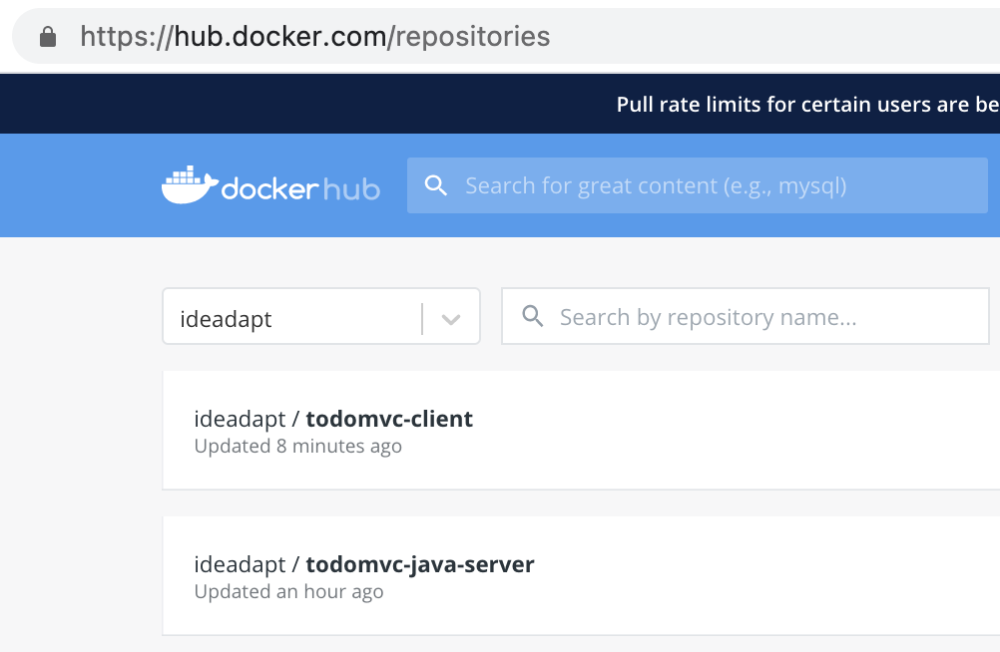
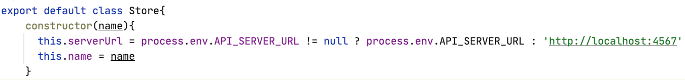
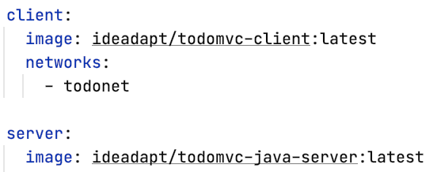
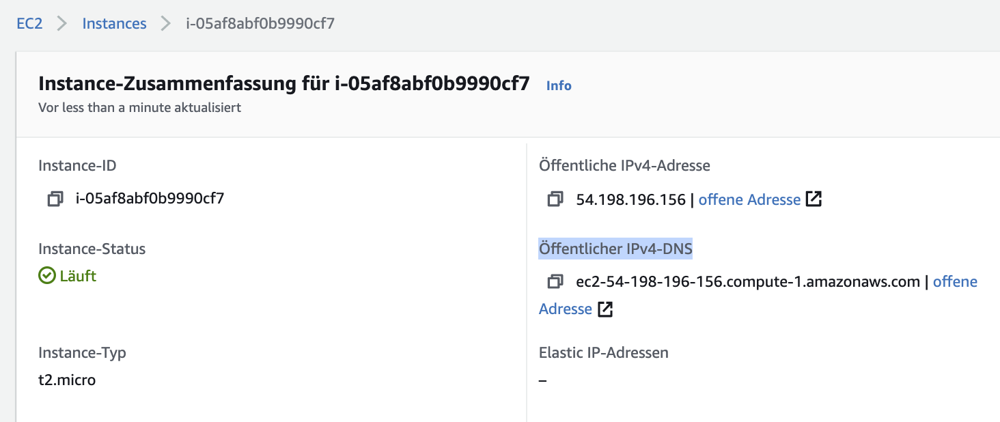
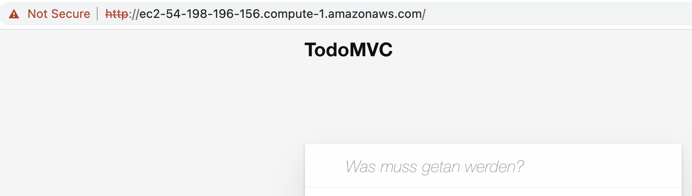

= TodoMVC AWS EC2 Setup
:toc:
:toclevels: 3
:tip-caption: 💡
:warning-caption: ⚠️
:source-highlighter: highlightjs

== Einleitung

In diesem Tutorial wirst du die TodoMVC Applikation in der AWS (Amazon Web Services) Cloud deployen.
Dazu nutzen wir Werkzeuge wie: Docker, SSH, Maven, NPM, Bash und Git.

Am Ende wirst du eine öffentlich erreichbare URL haben, auf der die Applikation läuft, inklusive Datenbank.

== Vorbedingungen

* Du hast bei dir lokal https://github.com/ibwgr/todomvc-java-server
* Du hast bei dir lokal deinen Fork von https://github.com/ibwgr/todomvc-es6-custom.
Dein Fork muss auf dem aktuellsten Stand sein.
* Docker, NPM und Git funktioniert bei dir lokal.
* Du hast eine Linux basierte Umgebung. Auf Windows reicht auch die git Bash mit aktiviertem SSH Feature https://learn.microsoft.com/de-ch/windows/terminal/tutorials/ssh.
Sämtliche Befehle und Beispiele sind nicht für Windows ausgelegt.

== Server in AWS Cloud erstellen

=== Ziel

====
* [*] Eigener, kostenloser Linux Webserver läuft in der AWS Cloud
====

=== Schritte

* [ ] Als Erstes musst du einen Account bei Amazon anlegen
* [ ] Dann Login auf https://aws.amazon.com/de/console
* [ ] EC2 Micro Instanz erstellen
* [ ] Port 80 und 443 (HTTPS) in der Firewall öffnen.
Port 22 (SSH) ist bereits offen.

Im folgenden Video siehst du, wie das geht:

video::media/create-instance-cut.mp4[width=600]

EC2 (Elastic Compute Cloud) ist ein Service von AWS. Eine EC2 Instanz ist eine virtuelle Maschine, welche in einem Rechenzentrum von AWS läuft. AWS (Amazon Web Services) ist die Cloud-Dienstleistung von Amazon.

== Verbinden & Clonen

=== Ziel

====
* [*] Login via SSH auf dem AWS Server
* [*] TodoMVC Repository auf Server gecloned
====

=== Schritte

TIP: Du brauchst die pem-Datei (KeyPair) aus dem vorigen Schritt.

* [ ] KeyPair konfigurieren
* [ ] Login via SSH auf dem AWS Server
* [ ] Clone GitHub Repository Fork

WARNING: Clone unbedingt deinen eigenen Fork via https URL.

Im folgenden Video siehst du, wie das geht:

video::media/ssh-clone-cut.mp4[height=600]

== Docker Images Deployment

=== Ziel

====
* [*] Docker Images von Client und Server auf Docker Hub deployed

====

=== Schritte

* [ ] Docker Hub Account erstellen
* [ ] TodoMVC Client Image lokal builden und auf Docker Hub pushen
* [ ] TodoMVC Server Image lokal builden und auf Docker Hub pushen
* [ ] docker-compose Image Name anpassen

==== Docker Hub Account erstellen

* Erstelle einen Account auf https://hub.docker.com/
* Logge dich in deiner Shell auf Docker Hub ein: `docker login`

==== TodoMVC Client Image lokal builden und auf Docker Hub pushen

Der Pfad des folgenden Befehls wird bei dir anders sein.

[source,bash]
----
cd ~/clones/todomvc-es6-custom
----

===== Konfiguration

Bevor wir das Image erstellen, müssen wir die Konfiguration für den Parcel Build anpassen:

* Kopiere dazu die Datei dev.env als .env. Entsprechender Bash Befehl: `cp dev.env .env`
* Setze API_SERVER_URL auf "". Entsprechender Bash Befehl: `echo API_SERVER_URL="" >> .env`

Der Wert von API_SERVER_URL wird von Parcel gelesen und im folgenden JavaScript Code ersetzt:

Das heisst im kompilierten JavaScript steht dann `this.serverUrl = ""`.
Du kannst das überprüfen, indem du lokal `npm run build` ausführst und dann im dist Ordner in der app*.js Datei die serverUrl Definition anschaust.

===== Build & Push Client

Anstelle von ideadapt musst du deine eigene Docker Hub Account ID verwenden.

[source,bash]
----
docker build --tag ideadapt/todomvc-client:latest .
docker push ideadapt/todomvc-client:latest
----

==== TodoMVC Server Image lokal builden und auf Docker Hub pushen

Anstelle von ideadapt musst du deine eigene Docker Hub Account ID verwenden.
Ebenfalls wird der Pfad des ersten Befehls (cd) bei dir anders sein.

[source,bash]
----
cd ~/clones/todomvc-java-server
docker build --tag ideadapt/todomvc-java-server:latest .
docker push ideadapt/todomvc-java-server:latest
----

==== docker-compose Image Namen anpassen

Zurzeit steht in der docker-compose.yml noch nicht deine Docker Hub Account ID, sondern meine.
Ersetze also ideadapt durch deine Docker Hub Account ID. Pushe die Änderungen auf deinen Fork.

[source,bash]
----
cd ~/clones/todomvc-es6-custom
# Image Name ändern
git add docker-compose.yml
git commit -m "set my personal docker hub account id"
git push
----

== TodoMVC Applikation starten

=== Ziel

====
* [*] Webapplikation ist via Browser erreichbar
====

=== Schritte

* [ ] Login via SSH auf dem AWS Server
* [ ] Git pull
* [ ] Konfiguration erstellen
* [ ] docker-compose installieren
* [ ] Alle Container via docker-compose starten

==== Login via SSH auf dem AWS Server

Passe den pem-Pfad und die Serveraddresse entsprechend deiner EC2-Instanz an:

[source,bash]
----
ssh -i todomvc-ec2.pem ubuntu@ec2-54-198-196-156.compute-1.amazonaws.com
cd todomvc-es6-custom
git pull origin master
----

==== Konfiguration erstellen

Die Konfiguration der MySQL Datenbank beinhaltet geheime Daten, z.B. das Passwort.
Damit diese nicht in Git eingecheckt sein müssen, verwenden wir wieder eine .env Datei (.env ist zur Sicherheit auch im .gitignore).
In unserem Tutorial verwenden wir die gleiche Konfiguration wie im dev.env.
In der echten Welt würde die .env Datei, bevor docker-compose gestartet wird, erstellt werden, mit den geheimen Inhalten.

[source,bash]
----
cp dev.env .env
----

==== docker-compose installieren

Auf dem Linux Server ist noch kein docker-compose installiert.
Das lässt sich einfach mit einem Befehl nachholen:

[source,bash]
----
sudo snap install docker
----

==== Container starten

Starte die Container zuerst ohne -d Option, um etwaige Fehler direkt zu sehen.

[source,bash]
----
sudo docker-compose up
----

TIP: Du kannst jederzeit erneut ein Docker Image build & push ausführen. Das bisherige Image wird damit überschrieben. Damit dieses neue Image angezogen wird, musst du vor dem `docker-compuse up` `docker-compuse pull` ausführen.

Teste, ob die Applikation erreichbar ist.
Rufe dazu die URL aus dem EC2 Dashboard auf.

WARNING: Zurzeit läuft die Applikation erst auf *HTTP*.

== Nächste Schritte

Continuous Deployment.
Sprich: Wenn wir etwas auf den master Branch pushen, wird es direkt auf AWS deployed.
